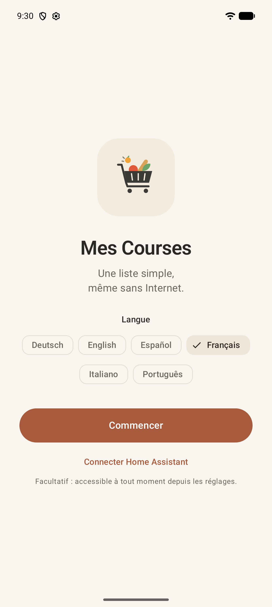

<p align="center">
  
</p>

<h1 align="center">courses</h1>

<p align="center">
  Une liste de courses Android simple, rapide et <strong>hors ligne</strong>,<br />
  avec synchronisation facultative avec Home Assistant.
</p>

## Avertissement

> [!WARNING]
> Cette application a été **développée avec l'aide d'une intelligence artificielle**.
> Le code, les tests et la documentation ont été produits en grande partie par IA puis vérifiés
> par des tests automatisés, mais tout n'a pas été relu ligne à ligne ni validé dans toutes les
> situations réelles. Utilisez-la en connaissance de cause et consultez les
> [limites connues](docs/limites-connues.md).

## Présentation

**courses** part d'une idée simple : *ouvrir → taper → sélectionner → cocher*. L'application
démarre directement sur la liste, sans compte, sans configuration et sans écran de chargement.
Tout est stocké sur le téléphone : on peut consulter et modifier ses listes au fond d'un magasin,
sans réseau.

Pour partager une liste avec la famille ou l'afficher sur un tableau de bord, elle peut se
synchroniser avec les listes `todo` d'une instance **Home Assistant** auto-hébergée. C'est
entièrement facultatif.

Fonctionnalités principales :

- **plusieurs listes**, avec quantités et unités (`12`, `1,5 kg`) ;
- **autocomplétion instantanée et hors ligne**, tolérante aux fautes de frappe, qui apprend les
  produits achetés le plus souvent ;
- **catalogue alimentaire local** : un catalogue de base embarqué, complété chaque semaine par
  la taxonomie d'[OpenFoodFacts](https://world.openfoodfacts.org/), sans jamais envoyer ce qui est
  tapé ;
- **rangement par rayon** (fruits et légumes, boulangerie, produits laitiers…), facultatif ;
- **six langues** : français, anglais, allemand, espagnol, italien, portugais ;
- **Home Assistant (facultatif)** : synchronisation dans les deux sens, en temps réel quand
  l'application est ouverte, sans perte des modifications faites hors ligne ;
- thème clair, sombre ou système, Material 3 ;
- **aucun compte, aucun analytics, aucune dépendance aux services Google Play** : fonctionne sur
  GrapheneOS.

### Aperçu

| Premier lancement | Liste de courses | Autocomplétion |
| --- | --- | --- |
|  |  |  |

| Rangement par rayon | Thème sombre | Réglages |
| --- | --- | --- |
|  |  |  |

Captures prises sur un émulateur avec des données fictives.

## Installation

Il n'existe pas de version publiée sur un store : l'APK signé de chaque version est joint aux
releases GitHub du dépôt, ou l'application se compile depuis les sources.

Prérequis : Android Studio récent (JDK 21 embarqué), SDK Android 37, et un téléphone ou un
émulateur sous **Android 17 (API 37)** minimum.

```powershell
$env:JAVA_HOME="C:\Program Files\Android\Android Studio\jbr"
.\gradlew.bat :app:assembleDebug
.\gradlew.bat :app:installDebug
```

Détails, vérifications et release signée : [Développement](docs/developpement.md).

## Home Assistant en bref

1. Dans Home Assistant : Profil → Sécurité → Jetons d'accès longue durée → créer un jeton (le QR
   code peut être scanné par l'application).
2. Dans l'application : Réglages → Home Assistant → adresse, token, **Tester la connexion**.
3. Choisir pour chaque liste : la créer dans Home Assistant, la lier à une liste existante ou la
   garder locale.

Le token est chiffré par le Keystore Android et n'est jamais réaffiché. Guide complet :
[Home Assistant](docs/home-assistant.md).

## Confidentialité

- Les listes, l'historique d'ajout et les préférences restent sur le téléphone.
- Le seul service externe contacté sans action de l'utilisateur est le serveur statique
  d'OpenFoodFacts, une fois par semaine au plus, pour télécharger le catalogue.
- Home Assistant n'est contacté que s'il a été configuré.

## Stack

| Couche | Technologie |
| --- | --- |
| Langage | Kotlin, coroutines, Flow |
| Interface | Jetpack Compose, Material 3, Navigation Compose |
| Données | Room (seule source de vérité), DataStore |
| Injection | Hilt |
| Réseau | Retrofit, OkHttp (REST et WebSocket), Kotlin Serialization |
| Sécurité | Android Keystore (AES-256-GCM) |
| Scan QR | CameraX + ZXing |
| Plateforme | Android 17 (API 37) minimum |

## Documentation

Toute la documentation est dans [`docs/`](docs/README.md) :

- [Interface](docs/interface.md) · [Fonctionnement hors ligne](docs/hors-ligne.md) ·
  [Langues](docs/langues.md)
- [Catalogue et autocomplétion](docs/catalogue.md) · [Catégories](docs/categories.md)
- [Home Assistant](docs/home-assistant.md) · [Synchronisation](docs/synchronisation.md) ·
  [Stratégie de conflit](docs/conflits.md)
- [Architecture](docs/architecture.md) · [Décisions d'architecture (ADR)](docs/adr/README.md)
- [Sécurité et confidentialité](docs/securite.md) · [Limites connues](docs/limites-connues.md)
- [Développement](docs/developpement.md) · [Tests](docs/tests.md) ·
  [Release signée](docs/release.md)

Règles de contribution (humains et agents) : [`AGENTS.md`](AGENTS.md).

## Licence

Copyright © 2026 sargo.

courses est un logiciel libre distribué sous licence **GNU General Public License v3.0** : vous
pouvez le redistribuer et le modifier selon ses termes ; toute version modifiée et redistribuée
doit rester sous la même licence. Texte complet : [`LICENSE`](LICENSE).

Les données du catalogue proviennent d'[Open Food Facts](https://world.openfoodfacts.org) et
restent sous licence [ODbL](https://opendatacommons.org/licenses/odbl/1-0/).
