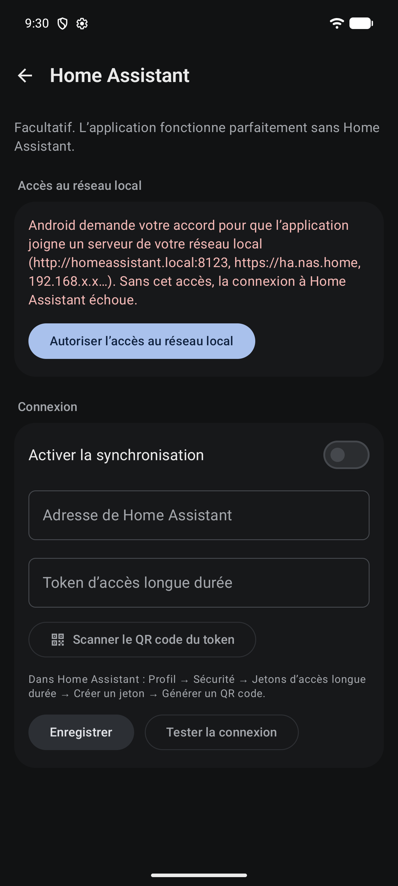

# Home Assistant

[← Documentation](README.md)

Entièrement **facultatif** : l'application fonctionne sans. Home Assistant sert de serveur de
synchronisation pour partager une liste entre plusieurs téléphones ou avec un tableau de bord, via
ses entités `todo.*`.

## État dans les réglages

Dans **Réglages**, l'entrée « Home Assistant » affiche « Non connecté — facultatif » tant qu'aucune
adresse et aucun token ne sont enregistrés. Dès qu'ils le sont, elle affiche « Connecté », l'adresse
et l'état de la synchronisation (« Synchronisé », « Synchronisation… », « Hors connexion »,
« Synchronisation impossible », modifications en attente), ou « Synchronisation désactivée » si
l'interrupteur est coupé : désactiver la synchronisation ne déconnecte pas Home Assistant.

## Connexion

Écran **Réglages → Home Assistant** :

- activer / désactiver la synchronisation ;
- **connexion repliée** : dès qu'une adresse et un token sont enregistrés, la carte « Connexion »
  n'affiche que « Connecté » (avec l'adresse) et l'interrupteur de synchronisation ; toucher
  « Connecté » déplie l'adresse, le token, le scan et les boutons. Une première configuration reste
  dépliée après « Enregistrer » pour pouvoir tester la connexion ;
- **adresse** (`http://homeassistant.local:8123`, `https://ha.nas.home`…, le schéma est ajouté si
  absent ; la correction automatique du clavier est désactivée sur ce champ) ;
- **token d'accès longue durée** (stocké chiffré, jamais réaffiché), saisi à la main ou **scanné** :
  Home Assistant affiche le token en QR code (Profil → Sécurité → Jetons d'accès longue durée →
  Générer un QR code). « Scanner le QR code du token » ouvre un scanner intégré (CameraX + ZXing,
  sans services Google) qui demande la permission Appareil photo au premier usage ; les images sont
  analysées en mémoire, jamais enregistrées ni envoyées. Seul un token valide (JWT) est accepté,
  puis « Enregistrer » le stocke ;
- **tester la connexion**. « Adresse invalide. » n'est affiché que pour une adresse réellement
  malformée, vérifiée avant tout appel ; une erreur interne de Retrofit est signalée comme
  « Réponse inattendue de Home Assistant. » ;
- **accès au réseau local** : une carte demande la permission `ACCESS_LOCAL_NETWORK` d'Android 17
  tant qu'elle manque ([Sécurité](securite.md#accès-au-réseau-local)).

## Modes des listes

`HaListMode` :

- **Uniquement les listes créées par cette application** (par défaut) : seules les listes créées
  depuis l'application sont synchronisées ; une liste qui existait déjà se lie à la main avec
  « Choisir ». Une liste supprimée dans Home Assistant est déliée et reste sur le téléphone.
- **Toutes les listes** : à l'activation puis à chaque synchronisation, chaque liste `todo.*`
  **modifiable** (ajout, modification et suppression d'articles) et disponible, qui n'est liée à
  aucune liste de l'application, y est **importée** avec ses articles
  (`shopping_lists.importedFromRemote`).
  - Elle prend le nom de Home Assistant ; si ce nom existe déjà dans l'application, un numéro est
    ajouté (« Courses 2 », `HaListNameAllocator`).
  - Un renommage fait ensuite dans Home Assistant renomme la liste importée (`remoteName` retient
    le dernier nom appliqué, donc un renommage fait dans l'application n'est pas écrasé tant que le
    nom ne change pas dans Home Assistant).
  - Une liste **supprimée dans Home Assistant** est supprimée de l'application, sauf si elle
    contient des modifications pas encore envoyées ou si c'est la dernière liste : elle est alors
    seulement déliée.
- **Listes ignorées** : supprimer dans l'application une liste liée créée ailleurs, la passer en
  « Ne pas synchroniser » ou la lier à une autre liste la mémorise dans `ha_ignored_lists` : elle
  reste dans Home Assistant et n'est plus importée. La lier de nouveau avec « Choisir » annule ce
  choix.
- **Repasser en « Uniquement les listes créées »** supprime du téléphone les listes importées,
  après confirmation (elles restent dans Home Assistant). La dernière liste de l'application est
  gardée, déliée. Le moteur refait ce ménage à la synchronisation suivante, au cas où une
  synchronisation en cours aurait importé une liste entre-temps.

## Liaison des listes

- **Créer automatiquement les nouvelles listes** (activé par défaut) : toute liste créée dans
  l'application est aussitôt marquée à synchroniser (`CREATE_LIST` écrit dans la même transaction
  que la liste) et créée dans Home Assistant à la synchronisation suivante. Désactivé, une nouvelle
  liste reste locale jusqu'à ce que l'utilisateur la lie avec « Choisir ».
- **Premier paramétrage** : dès que Home Assistant est activé et configuré, chaque liste qui
  existait déjà et n'est pas synchronisée est proposée tour à tour (créer dans Home Assistant, lier
  à une liste existante, ne pas synchroniser, ou « Plus tard »). Cette question n'est posée qu'une
  fois (`lists_setup_done` dans DataStore).
- **Pour chaque liste locale** : lier à une liste `todo.*` existante (toutes les listes de Home
  Assistant sont proposées, quel que soit le mode ; une copie importée de cette liste est alors
  remplacée), **créer** la liste dans Home Assistant (intégration *Local To-do*, créée par
  l'application et mémorisée dans `ha_tracked_lists`), ou ne pas synchroniser.
- **Noms déjà pris** : si une liste `todo.*` de Home Assistant porte déjà ce nom (casse, accents et
  ponctuation ignorés), un numéro est ajouté côté Home Assistant (« Courses 2 », « Courses 3 »…,
  `HaListNameAllocator`) ; le nom local ne change pas. Si *Local To-do* refuse quand même le nom
  (`already_configured`, liste masquée), le numéro suivant est essayé.
- Synchronisation automatique et « Synchroniser maintenant ».

## Suivi des changements faits dans Home Assistant

- **À l'ouverture** : chaque retour de l'application au premier plan déclenche une synchronisation.
- **Temps réel** : tant que l'application est au premier plan (synchronisation automatique activée,
  réseau disponible), une connexion WebSocket (`/api/websocket`, commande `todo/item/subscribe`)
  suit toutes les listes liées. Chaque changement annoncé déclenche une synchronisation normale
  (regroupée sur 1,5 s) : il n'y a qu'un seul chemin de fusion. Connexion perdue : nouvel essai
  après 5 s, puis un délai croissant jusqu'à 5 min. Elle est fermée quand l'application passe en
  arrière-plan ([ADR 0017](adr/0017-temps-reel-websocket-okhttp.md)).
- **Tirer pour actualiser** sur la liste de courses.
- **Articles créés dans Home Assistant** : rattachés au catalogue alimentaire (produit existant de
  même nom, sinon produit personnalisé créé), donc proposés ensuite dans l'autocomplétion, et rangés
  dans leur catégorie selon leur nom ([Catégories](categories.md)).
- **Liste indisponible** (intégration arrêtée, état `unavailable`, pour laquelle Home Assistant
  répond HTTP 500) : grisée et non sélectionnable dans le choix des listes. Déjà liée, elle est
  ignorée à la synchronisation, ses modifications restent en file et l'indicateur affiche
  « Liste Home Assistant indisponible ».

## API utilisées

| Type | Appels |
| --- | --- |
| REST | `GET /api/`, `GET /api/states`, `POST /api/services/todo/get_items?return_response`, `todo.add_item`, `todo.update_item`, `todo.remove_item` |
| Configuration | `POST /api/config/config_entries/flow` (création *Local To-do*), `DELETE /api/config/config_entries/entry/{id}` |
| WebSocket | `auth`, `todo/item/subscribe` |

**Quantités** : Home Assistant n'a pas de champ quantité. Pour les listes qui acceptent une
description (Local To-do), la quantité y est écrite (`2`, `1,5 kg`) ; une quantité de 1 sans unité
laisse la description vide.

Voir aussi : [Synchronisation](synchronisation.md), [Stratégie de conflit](conflits.md),
[Limites connues](limites-connues.md#home-assistant).
