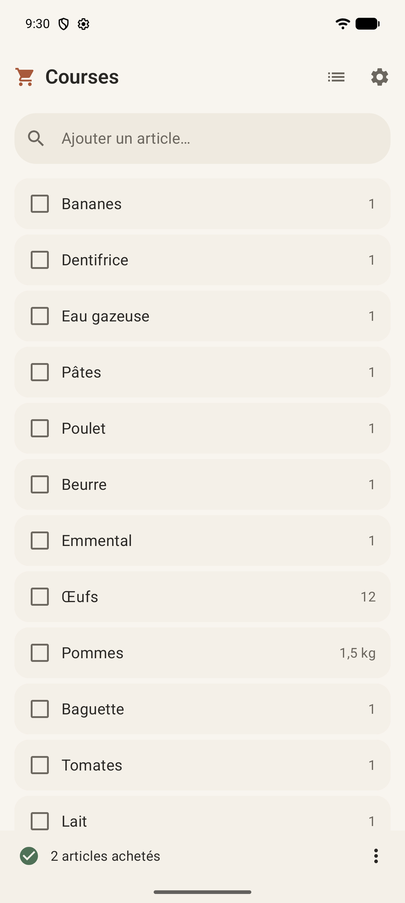
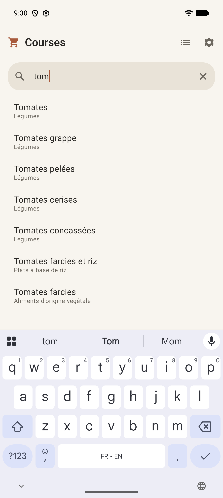
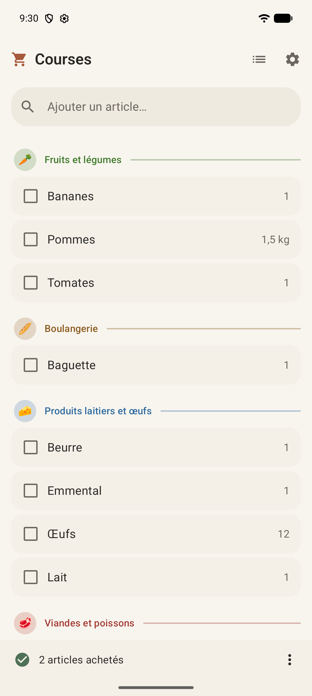
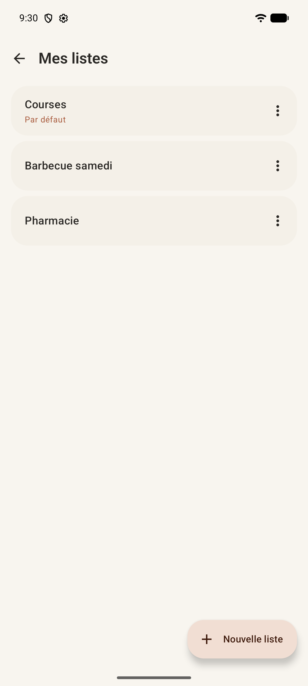
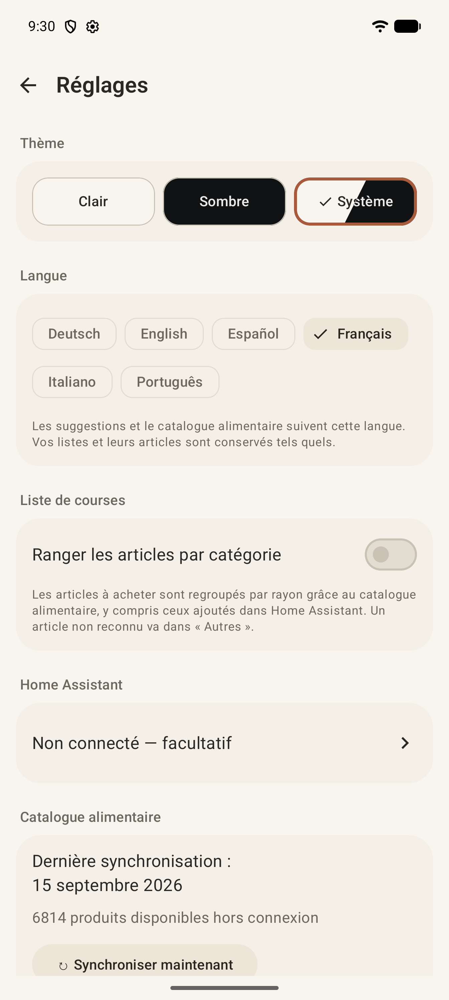
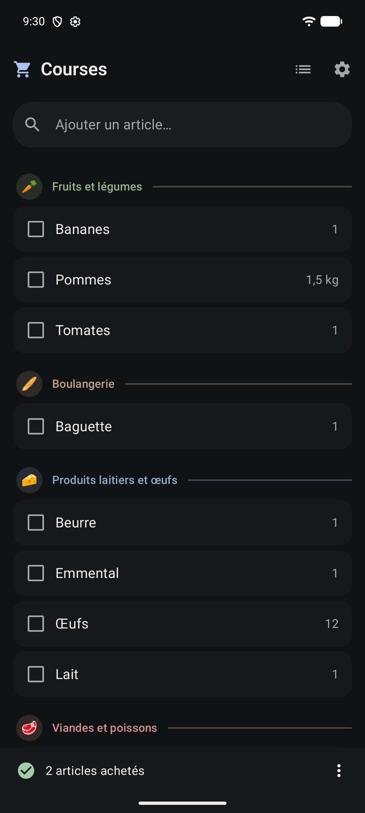

# Interface

[← Documentation](README.md)

Material 3, thème clair chaud et calme, thème sombre sobre, ou mode système. Tous les textes
visibles viennent des ressources (six langues, voir [Langues](langues.md)).

| Liste de courses | Autocomplétion | Rangement par catégorie |
| --- | --- | --- |
|  |  |  |

| Listes | Réglages | Thème sombre |
| --- | --- | --- |
|  |  |  |

## Liste de courses

- Un champ en haut de la liste ajoute un article ; les suggestions du catalogue apparaissent dès
  la première lettre ([Catalogue et autocomplétion](catalogue.md)).
- **Quantité tapée avec le nom** (`ItemEntryParser`) : « 2 pain », « 2x pain », « 500g de pâtes »,
  « 1 kg d'oranges », « 1,5 L lait », ou après le nom avec une unité ou un signe de multiplication
  (« pâtes 500 g », « lait x2 »). Les suggestions sont cherchées pour le nom seul (« pâtes ») et
  portent la quantité détectée (« × 2 », « 500 g ») ; toucher une suggestion, « Ajouter … » ou
  « OK » au clavier ajoute le produit avec cette quantité, sans passer par l'édition. Un pluriel
  tapé avec une quantité retrouve le produit au singulier (« 2 pains » ajoute « Pain »). Seuls les
  poids et volumes sont des unités (g, kg, mg, L, cl, dl, ml, lb, oz, et leurs noms dans les six
  langues) ; un nombre seul après le nom en fait partie (« Pastis 51 »).
- **Historique** : toucher le champ sans rien taper affiche, sous le titre « Historique » (icône
  d'horloge), les produits ajoutés le plus souvent, sauf ceux déjà à acheter dans la liste ; un
  article acheté reste proposé (l'ajouter le remet « à acheter »). Toucher un produit l'ajoute et le
  retire de l'historique ; le champ garde le focus pour en ajouter plusieurs à la suite. Taper une
  lettre remplace l'historique par les suggestions ; « retour » (clavier fermé) quitte l'historique.
  Rien ne s'affiche si l'historique est vide ou désactivé.
- Toucher un article le coche ; il passe dans « Achetés ». Le bas de l'écran indique le nombre
  d'articles achetés ; son menu « Plus d'actions » masque ou affiche les achetés et propose
  « Supprimer les articles achetés ».
- **« − » et « + »** au bout d'un article à acheter : un de plus ou de moins pour un produit
  compté, un pas adapté à la mesure sinon (100 g, 100 ml, 10 cl, 0,5 kg, 0,5 L) ; « − » est
  grisé quand un pas de moins ne laisserait rien (`QuantityStepper`). Un article acheté montre
  seulement sa quantité.
- Appui long sur un article : modifier son nom et sa quantité.
- Glisser un article vers la gauche : le supprimer. Ces deux actions sont aussi proposées aux
  lecteurs d'écran comme actions d'accessibilité.
- **Annuler une suppression** : un article supprimé (glissement, boîte d'édition ou lecteur
  d'écran) disparaît aussitôt et un message « « Lait » supprimé · Annuler » s'affiche quelques
  secondes. La suppression n'est écrite (et envoyée à Home Assistant) qu'à la fin du message, en
  supprimant un autre article ou en quittant la liste ; « Annuler » ne modifie rien. Si
  l'application est tuée pendant ces secondes, l'article reste.
- **Ajouter un article déjà présent** : sa quantité augmente de 1, sauf s'il a une unité
  (« 500 g » est une mesure, pas un nombre) ; un article acheté repasse « à acheter ». Une quantité
  tapée s'ajoute à celle en attente dans la même unité (« 2 pain » sur 1 pain donne 3) et la
  remplace sinon ; un article acheté reprend la quantité tapée.
- **Article ajouté** : la liste défile jusqu'à lui s'il est hors de vue et il s'illumine
  brièvement, pour voir où il est arrivé (même s'il a seulement été incrémenté).
- **Articles achetés** : l'en-tête « Achetés » porte à droite un bouton corbeille qui supprime tous
  les articles cochés, **après confirmation** (la même boîte de dialogue que « Supprimer les
  articles achetés » dans le menu du bas de l'écran). Annuler ne supprime rien.
- **Rangement par catégorie** (désactivé par défaut) : voir [Catégories](categories.md).
- **Tirer pour actualiser** quand Home Assistant est activé.

## Listes

- Toucher une liste l'ouvre ; son menu propose Renommer, Définir par défaut, Monter, Descendre et
  Supprimer.
- **Nouvelle liste** demande un nom. Avec Home Assistant configuré en mode « Uniquement les listes
  créées par cette application », la boîte propose aussi « Importer une liste de Home Assistant » :
  choisir une liste de Home Assistant (une liste Mealie par exemple) l'ajoute liée et l'ouvre
  ([Home Assistant](home-assistant.md#liaison-des-listes)).
- **Réordonner** : glisser une liste par sa poignée (deux barres, à gauche). La liste tenue se
  soulève (ombre) et suit le doigt ; les autres s'écartent ; un léger retour haptique marque la
  prise et chaque liste dépassée. L'ordre n'est écrit qu'au lâcher. « Monter » et « Descendre »
  font la même chose sans glisser (lecteurs d'écran). L'ordre est local
  (`shopping_lists.position`) : Home Assistant n'a pas d'ordre des listes. Une nouvelle liste, ou
  une liste importée de Home Assistant, va à la fin.

## Réglages

- **Thème** : trois boutons compacts (48 dp de haut) sur une ligne, **Clair**, **Sombre** et
  **Système**, peints avec le fond de leur thème ; « Système » est coupé par une barre oblique
  nette (`[ clair / sombre ]`), sans fondu, et chaque partie de son libellé prend la couleur lisible
  sur son côté. Le choix courant est encadré et coché.
- **Langue** : puces portant chacune le nom de la langue dans cette langue.
- **Liste de courses** : ranger les articles par catégorie.
- **Historique** : « Afficher l'historique dans la recherche » (activé par défaut) et « Vider
  l'historique » (après confirmation, grisé si l'historique est vide). Vider l'historique efface les
  statistiques d'usage (`product_usage`) : les suggestions ne favorisent plus les anciens ajouts.
  Les listes et les produits personnalisés sont conservés.
- **Catalogue alimentaire** : nombre de produits disponibles hors connexion et attribution
  Open Food Facts. Rien à synchroniser : le catalogue est livré avec l'application.
- **Home Assistant** : état de la connexion, voir [Home Assistant](home-assistant.md).

## Transitions entre écrans

`NavigationTransitions` : glissement horizontal de 350 ms au lieu du fondu enchaîné par défaut.
Le nouvel écran entre par le bord de fin pendant que l'ancien sort par le bord de début, à la même
vitesse, tous deux opaques et bord à bord : rien n'est jamais transparent, donc aucun flash, quel
que soit le thème (le fond de la fenêtre suit le thème du système, pas celui choisi dans
l'application ; le `NavHost` est en plus peint avec le fond du thème de l'application). Le retour,
y compris le geste retour prédictif, joue le mouvement inverse. Le sens suit la direction de
lecture et l'échelle d'animation du système s'applique (`NavigationTransitionsTest`).

## Animations

Toutes passent par Compose et suivent l'échelle d'animation du système (désactivées si le
téléphone les coupe). Aucune bibliothèque ajoutée.

- **Cocher** : le fond et la couleur du nom glissent vers l'état acheté, un trait barre le nom de
  gauche à droite, ligne après ligne (`StrikethroughText`), la case rebondit légèrement ; retour
  haptique « activé / désactivé ». Décocher joue l'inverse.
- **Glisser pour supprimer** : le fond reste gris tant que le geste ne suffit pas, puis devient
  rouge, la corbeille grossit et un retour haptique signale le seuil, avant de lâcher.
- **Historique, suggestions et liste** se remplacent par un fondu court (150 ms) ; les suggestions
  apparaissent et se réordonnent en douceur (`animateItem`).
- **Quantité et nombre d'achetés** défilent comme un compteur, vers le haut ou le bas selon le sens
  du changement (`RollingValue`).
- **Liste vide** et **« Tout est acheté »** : l'icône apparaît avec un rebond, puis le texte monte
  en fondu (`AppearingStatus`).
- **Indicateur de synchronisation** : couleur et libellé passent d'un état à l'autre en fondu ; le
  point respire doucement tant que des modifications attendent d'être envoyées.
- **Thème** : changer de thème (ou le thème du système en mode Système) fait glisser toutes les
  couleurs en 400 ms au lieu de basculer d'un coup (`animatedColorScheme`). Changer de langue
  recrée l'activité (Android) : pas d'animation propre à l'application.

## Barres système

L'heure, le réseau, la batterie et la barre de navigation suivent le thème **choisi dans
l'application** (icônes sombres en thème clair, claires en thème sombre), même quand il diffère du
thème du téléphone (`SystemBarsAppearance`, appelé par `CoursesTheme`).

## Accessibilité

`contentDescription` sur les actions iconographiques, zones tactiles d'au moins 48 dp, contraste
vérifié dans les deux thèmes.
